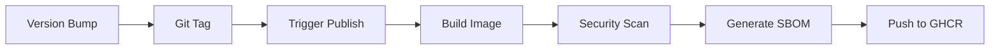

# UBI Architecture

## Overview

**UBI (Universal Base Image)** serves as the foundational development container for all Ego Hygiene projects. It provides a consistent, reproducible, and developer-experience-optimized platform that eliminates environment drift and configuration overhead.

## Core Goals

### 1. Consistency Across Projects

Every developer and CI environment works with an identical baseline, ensuring:

- Predictable behavior across local development and CI/CD
- Reduced "works on my machine" issues
- Standardized tooling and configuration

### 2. Reproducibility

All builds are deterministic and auditable through:

- Semantic versioning (SemVer)
- Pinned base image with digest verification
- Version-tagged releases published to GHCR
- Immutable container images

### 3. Developer Experience (DX)

Sensible defaults reduce friction:

- Pre-configured environment variables
- Standardized filesystem layout
- XDG-compliant directory structure
- Telemetry disabled by default
- Modern terminal and editor support

### 4. Maintainability

Single source of truth for environment configuration:

- Update once, benefit everywhere
- Clear versioning and changelog
- Automated release pipeline
- Security scanning and SBOM generation

---

## XDG Base Directory Strategy

UBI follows the [XDG Base Directory Specification](https://specifications.freedesktop.org/basedir-spec/basedir-spec-latest.html) to provide predictable locations for configuration, cache, and application data.

### Standard XDG Variables

```bash
XDG_CONFIG_HOME=/opt/universal/config   # Application configuration
XDG_CACHE_HOME=/opt/universal/cache     # Application caches
XDG_DATA_HOME=/opt/universal/toolbox    # Application data
XDG_STATE_HOME=/opt/universal/runtime   # Application state
```

### Benefits

- **Predictability**: Applications know where to store data
- **Cleanliness**: No scattered dotfiles in home directory
- **Isolation**: Clear separation between config, cache, and data
- **Compliance**: Industry-standard approach adopted by modern tools

---

## Universal Filesystem Layout

The `/opt/universal` hierarchy provides a centralized, organized structure for all development resources.

### Directory Structure

```
/opt/universal/
├── bin/           # Universal binaries and executables
├── config/        # Configuration files (XDG_CONFIG_HOME)
├── cache/         # Cache directory (XDG_CACHE_HOME)
│   └── apt/       # APT package cache
├── toolbox/       # Data files (XDG_DATA_HOME)
├── runtime/       # Runtime state (XDG_STATE_HOME)
├── logs/          # Centralized application logs
├── apps/          # Application resources (XDG_DATA_DIRS)
├── reports/       # Generated reports and artifacts
├── lib/           # Shared libraries
├── locks/         # Lock files for resource coordination
└── fonts/         # Custom fonts
```

### Environment Variables

All paths are exposed as environment variables for easy reference:

```bash
UNIVERSAL_HOME=/opt/universal
UNIVERSAL_BIN=/opt/universal/bin
UNIVERSAL_CONFIG=/opt/universal/config
UNIVERSAL_CACHE=/opt/universal/cache
UNIVERSAL_TOOLBOX=/opt/universal/toolbox
UNIVERSAL_RUNTIME=/opt/universal/runtime
UNIVERSAL_LOGS=/opt/universal/logs
UNIVERSAL_APPS=/opt/universal/apps
UNIVERSAL_REPORTS=/opt/universal/reports
UNIVERSAL_LIB=/opt/universal/lib
UNIVERSAL_LOCKS=/opt/universal/locks
UNIVERSAL_FONTS=/opt/universal/fonts
```

---

## Devcontainer Architecture

UBI is designed to be consumed as a base image for VS Code devcontainers.

### Usage Pattern

Projects inherit from UBI and extend as needed:

```json
{
  "name": "My Project",
  "image": "ghcr.io/egohygiene/ubi:0.1.5",
  "features": {
    // Project-specific devcontainer features
  },
  "customizations": {
    "vscode": {
      // VS Code settings
    }
  }
}
```

### Key Features

- **Base Image**: `mcr.microsoft.com/devcontainers/base:2.1.2` (pinned with digest)
- **User**: `vscode` (non-root by default)
- **Shell**: Bash with safer defaults (errexit, pipefail, nounset)
- **Security**: No privileged mode required (see [security documentation](./security-overview.md))

---

## CI/CD Architecture

### Build Pipeline

UBI uses a fully automated CI/CD pipeline powered by GitHub Actions.



### Workflows

1. **`bump-version.yml`**: Manual trigger to bump SemVer version
   - Uses `bump-my-version` tool
   - Updates VERSION, CHANGELOG.md, and pyproject.toml
   - Creates git commit and tag

2. **`publish.yml`**: Automated image build and publish
   - Triggered on push to main or tag creation
   - Multi-platform builds (amd64, arm64)
   - Publishes to GHCR with multiple tags
   - Generates SBOM with Syft

3. **`trivy-scan.yml`**: Container vulnerability scanning
   - Runs on PRs, pushes, and weekly schedule
   - Scans for CVEs in base image and dependencies
   - Uploads results to GitHub Security tab

4. **`test-unified.yml`**: Unified container testing
   - Comprehensive Goss validation for base variant
   - Multi-variant testing (base, minimal, python, node, full)
   - Validates environment variables and directory structure
   - Tests permissions, locale, and fundamental tools
   - Structured test reports with JSON output

---

## Multi-Stage Build Process

The Dockerfile uses a three-stage build for clarity and organization.

### Stage 1: Base

```dockerfile
FROM mcr.microsoft.com/devcontainers/base:2.1.2@sha256:... AS base
```

- Establishes the foundation from Microsoft's devcontainer base
- Sets safer shell defaults
- Pinned with digest for reproducibility

### Stage 2: Environment

```dockerfile
FROM base AS environment
```

- Defines all build arguments (ARGs)
- Sets environment variables (ENVs)
- Configures XDG directories
- Establishes the `/opt/universal` structure

### Stage 3: Final

```dockerfile
FROM environment AS final
```

- Creates universal directories with proper permissions
- Sets up the vscode user
- Configures PATH and shell environment
- Final image ready for consumption

### Build Arguments

UBI supports customization via build arguments:

```bash
docker build \
  --build-arg LANG=en_US.utf8 \
  --build-arg TZ=America/New_York \
  --build-arg EDITOR=vim \
  -f .devcontainer/Dockerfile \
  -t ubi:custom .
```

---

## Versioning Strategy

### Semantic Versioning (SemVer)

UBI follows strict SemVer: `MAJOR.MINOR.PATCH`

- **MAJOR**: Breaking changes to environment or filesystem structure
- **MINOR**: New features, tools, or non-breaking enhancements
- **PATCH**: Bug fixes and minor updates

### Version Sources

- **`VERSION` file**: Single source of truth (e.g., `0.1.5`)
- **`pyproject.toml`**: Python tooling compatibility
- **CHANGELOG.md**: Automatically updated on version bump
- **Git tags**: Created automatically by bump workflow

### Image Tags

Every release publishes multiple tags to GHCR:

```
ghcr.io/egohygiene/ubi:latest          # Always points to latest stable
ghcr.io/egohygiene/ubi:0.1.5           # Specific version (pinned)
ghcr.io/egohygiene/ubi:sha-abc123      # Git commit SHA (reproducibility)
```

**Recommendation**: Use specific version tags (e.g., `0.1.5`) in production environments.

---

## Security Architecture

UBI implements multiple layers of security:

1. **Base Image Pinning**: Digest-pinned base image prevents supply chain attacks
2. **No Privileged Mode**: Container runs with standard isolation (see [privileged-mode.md](./security/privileged-mode.md))
3. **Vulnerability Scanning**: Automated Trivy scans on every build
4. **SBOM Generation**: Software Bill of Materials for transparency
5. **Non-Root User**: Runs as `vscode` user by default

For detailed security information, see [security-overview.md](./security-overview.md).

---

## Environment Configuration

### Locale and System

```bash
LANG=en_US.utf8
LC_ALL=en_US.utf8
TZ=UTC
TERM=xterm-256color
```

### Development Tools

```bash
EDITOR=code              # VS Code as default editor
VISUAL=code
PAGER=less
GIT_PAGER=less
```

### Language-Specific

**Python:**

```bash
PYTHONUNBUFFERED=1
PYTHONIOENCODING=UTF-8
PYTHONUTF8=1
PIP_NO_CACHE_DIR=1
```

**Node.js:**

```bash
NODE_OPTIONS=--max-old-space-size=4096
```

**Rust:**

```bash
CARGO_TERM_COLOR=always
```

### Privacy

All telemetry is disabled by default:

```bash
DO_NOT_TRACK=1
TELEMETRY_ENABLED=0
NEXT_TELEMETRY_DISABLED=1
DOTNET_CLI_TELEMETRY_OPTOUT=1
```

---

## Design Decisions

### Why `/opt/universal`?

- **FHS Compliant**: `/opt` is designated for add-on software packages
- **Centralized**: Single hierarchy for all resources
- **Predictable**: Clear structure easy to navigate and understand
- **Non-Intrusive**: Doesn't conflict with system directories

### Why Pin Base Image with Digest?

- **Reproducibility**: Same digest always pulls identical image
- **Security**: Prevents tag hijacking and supply chain attacks
- **Auditability**: Exact image version is traceable
- **Stability**: Protects against unexpected upstream changes

### Why Semantic Versioning?

- **Clarity**: Clear communication of change impact
- **Automation**: Tools can parse and compare versions
- **Standard**: Industry-wide convention
- **Predictability**: Consumers know what to expect

---

## Future Considerations

### Planned Enhancements

- **Cosign Image Signing**: Cryptographic verification of images
- **Multi-Language Runtime Support**: Optional language runtimes via features
- **Performance Optimizations**: Layer caching improvements
- **Documentation Site**: MkDocs-powered documentation portal

### Extensibility

UBI is designed to be extended, not modified:

- Projects layer on top via Dockerfile or devcontainer features
- Base remains stable and minimal
- Extensions don't affect UBI's core functionality

---

## References

- [XDG Base Directory Specification](https://specifications.freedesktop.org/basedir-spec/basedir-spec-latest.html)
- [Filesystem Hierarchy Standard (FHS)](https://refspecs.linuxfoundation.org/FHS_3.0/fhs/index.html)
- [Semantic Versioning 2.0.0](https://semver.org/)
- [DevContainers Specification](https://containers.dev/)
- [Microsoft DevContainers Base Image](https://github.com/devcontainers/images/tree/main/src/base-debian)
