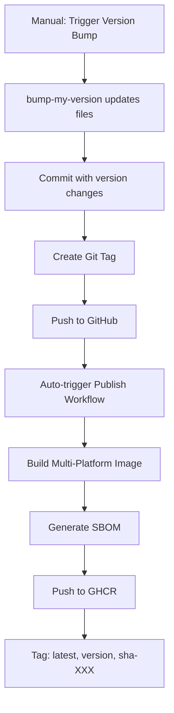

# Release Process

This document describes the complete release process for UBI, from version bumping to publishing the container image to GitHub Container Registry (GHCR).

---

## Table of Contents

- [Overview](#overview)
- [VERSION File Rules](#version-file-rules)
- [Semantic Versioning](#semantic-versioning)
- [Version Bump Workflow](#version-bump-workflow)
- [Publish Pipeline](#publish-pipeline)
- [SBOM Generation](#sbom-generation)
- [Release Checklist](#release-checklist)
- [Troubleshooting](#troubleshooting)

---

## Overview

UBI uses a fully automated release pipeline that follows this flow:



**Key Principles:**
- Single source of truth: `VERSION` file
- Automated synchronization across files
- Git tags trigger image publishing
- Semantic versioning (SemVer) enforced

---

## VERSION File Rules

The `VERSION` file at the repository root is the **single source of truth** for the current version.

### Format

```
0.1.5
```

**Rules:**
- Plain text file, no comments
- Single line with semantic version number
- Format: `MAJOR.MINOR.PATCH` (e.g., `0.1.5`)
- Trailing newline (Unix line ending: LF)
- No whitespace except trailing newline
- No prefixes (no `v` prefix)

### Valid Examples

```bash
# ✅ Valid
0.1.5

1.0.0

2.3.1
```

### Invalid Examples

```bash
# ❌ Invalid
v0.1.5          # No prefix allowed
0.1.5-beta      # No pre-release tags
 0.1.5          # No leading whitespace
0.1.5 \n\n      # Only one trailing newline
```

### Checking VERSION File

```bash
# View content with visible whitespace
cat -A VERSION

# Should output ($ represents newline):
# 0.1.5$

# Verify format
if [[ $(cat VERSION) =~ ^[0-9]+\.[0-9]+\.[0-9]+$ ]]; then
  echo "✅ Valid"
else
  echo "❌ Invalid format"
fi
```

---

## Semantic Versioning

UBI follows [Semantic Versioning 2.0.0](https://semver.org/).

### Version Format

```
MAJOR.MINOR.PATCH
```

**Note:** Pre-release versions (e.g., `1.0.0-alpha`, `2.0.0-beta.1`) are not supported based on the VERSION file format rules. Only stable release versions are allowed.

### When to Bump Each Component

#### MAJOR version (X.0.0)

Increment for **breaking changes** that require consumers to modify their setup:

- Changes to `/opt/universal` directory structure
- Removal or renaming of environment variables
- Changes to base image that break compatibility
- Removal of previously supported features

**Example:** Moving from `/opt/universal/bin` to `/opt/ubi/bin` → `1.0.0`

#### MINOR version (0.X.0)

Increment for **new features** that are backwards-compatible:

- Addition of new environment variables
- Addition of new directories in `/opt/universal`
- New tools or utilities installed
- Non-breaking enhancements to existing features

**Example:** Adding new telemetry opt-outs → `0.2.0`

#### PATCH version (0.0.X)

Increment for **bug fixes and minor updates**:

- Security patches to base image
- Bug fixes that don't change functionality
- Documentation updates
- Internal refactoring without external impact
- Dependency updates (if no behavior change)

**Example:** Fixing a typo in environment variable → `0.0.6`

### Special Cases

- **Pre-1.0.0**: Breaking changes are allowed in MINOR versions
  - `0.1.0` → `0.2.0` can include breaking changes
  - After `1.0.0`, breaking changes require MAJOR bump

- **Security Fixes**: 
  - If critical, may warrant out-of-band patch release
  - Document clearly in CHANGELOG

---

## Version Bump Workflow

Version bumping is handled by the `bump-version.yml` GitHub Actions workflow.

### Triggering a Version Bump

1. **Navigate to Actions tab in GitHub:**
   - Go to: https://github.com/egohygiene/ubi/actions
   - Select "🔼 Bump UBI Version" workflow

2. **Click "Run workflow"**

3. **Select bump type:**
   - `major` - For breaking changes (X.0.0)
   - `minor` - For new features (0.X.0)
   - `patch` - For bug fixes (0.0.X)

4. **Click "Run workflow" button**

### What Happens Automatically

The workflow performs these steps:

1. **Checkout repository** with full git history
   
2. **Install bump-my-version:**
   ```bash
   pip install bump-my-version
   ```

3. **Bump version** using configuration in `pyproject.toml`:
   ```bash
   bump-my-version [major|minor|patch]
   ```

4. **Files updated automatically:**
   - `VERSION` - Updated to new version
   - `pyproject.toml` - Updated in two places:
     - `[tool.poetry] version`
     - `[tool.bumpversion] current_version`
   - `CHANGELOG.md` - New version section inserted at top

5. **Create commit:**
   ```
   chore: bump version to X.Y.Z
   ```

6. **Create git tag:**
   ```
   X.Y.Z
   ```

7. **Push commit and tag to main branch**

### Configuration

Version bump behavior is configured in `pyproject.toml`:

```toml
[tool.bumpversion]
current_version = "0.1.5"
parse = "^(?P<major>\\d+)\\.(?P<minor>\\d+)\\.(?P<patch>\\d+)$"
serialize = ["{major}.{minor}.{patch}"]
commit = true
message = "chore: bump version to {new_version}"
tag = false  # Tagging done by CI

[[tool.bumpversion.files]]
filename = "VERSION"
search = "{current_version}"
replace = "{new_version}"

[[tool.bumpversion.files]]
filename = "CHANGELOG.md"
regex = true
search = "\\A## "
replace = """## {new_version} ({now:%Y-%m-%d})
[Compare the full difference.](https://github.com/egohygiene/ubi/compare/{current_version}...{new_version})

## """
```

### Local Version Bump (Testing)

To test version bumps locally without pushing:

```bash
# Install tool
pip install bump-my-version

# Dry run (no changes)
bump-my-version patch --dry-run --verbose

# Actually bump (creates commit, no tag)
bump-my-version patch

# Undo if needed
git reset --hard HEAD~1
```

---

## Publish Pipeline

The `publish.yml` workflow builds and publishes the UBI image to GHCR.

### Triggers

The publish workflow runs automatically on:
- **Push to main branch** (after version bump commit)
- **Tag creation** (after version bump workflow)
- **Manual trigger** (workflow_dispatch)

### Build Process

1. **Checkout repository**

2. **Read VERSION file:**
   ```bash
   VERSION=$(cat VERSION | tr -d '[:space:]')
   ```

3. **Set up build environment:**
   - QEMU for multi-architecture support
   - Docker Buildx for multi-platform builds

4. **Authenticate to GHCR:**
   ```bash
   echo $GITHUB_TOKEN | docker login ghcr.io -u ${{ github.repository_owner }} --password-stdin
   ```

5. **Generate metadata (tags and labels):**
   ```yaml
   tags: |
     type=raw,value=latest
     type=raw,value=${{ VERSION }}
     type=sha
   ```

6. **Build multi-platform image:**
   - Platforms: `linux/amd64`, `linux/arm64`
   - Context: Repository root
   - Dockerfile: `.devcontainer/Dockerfile`

7. **Push to GHCR with multiple tags:**
   ```
   ghcr.io/egohygiene/ubi:latest
   ghcr.io/egohygiene/ubi:0.1.5
   ghcr.io/egohygiene/ubi:sha-abc123
   ```

### Published Tags

Every release creates three tags:

| Tag Format | Example | Purpose |
|------------|---------|---------|
| `latest` | `ghcr.io/egohygiene/ubi:latest` | Always points to newest stable release |
| `X.Y.Z` | `ghcr.io/egohygiene/ubi:0.1.5` | Pinned version for reproducibility |
| `sha-XXXXXX` | `ghcr.io/egohygiene/ubi:sha-abc123` | Git commit SHA for exact reproducibility |

### Recommendations

- **Production**: Use specific version tags (`0.1.5`)
- **Development**: Use `latest` for convenience
- **Maximum reproducibility**: Use `sha-XXXXXX` tags

---

## SBOM Generation

A Software Bill of Materials (SBOM) is generated for every published image.

### What is an SBOM?

An SBOM is a formal, machine-readable inventory of:
- All software components in the image
- Package names and versions
- Dependencies and relationships
- License information
- Security vulnerability data

### Generation Process

The publish workflow uses [Syft](https://github.com/anchore/syft) to generate SBOMs:

```yaml
- name: Generate SBOM
  uses: anchore/sbom-action@v0
  with:
    image: ghcr.io/egohygiene/ubi:${{ VERSION }}
    format: spdx-json
    output-file: ubi-sbom.spdx.json
```

### SBOM Format

- **Format**: SPDX-JSON (Software Package Data Exchange)
- **Standard**: [SPDX 2.3](https://spdx.dev/)
- **Output**: `ubi-sbom.spdx.json`

### Accessing SBOMs

1. **Workflow Artifacts:**
   - Navigate to workflow run: https://github.com/egohygiene/ubi/actions/workflows/publish.yml
   - Download artifact: `ubi-sbom-X.Y.Z`
   - Retention: 90 days

2. **Generate Locally:**
   ```bash
   # Install Syft
   brew install syft  # macOS
   # or
   curl -sSfL https://raw.githubusercontent.com/anchore/syft/main/install.sh | sh -s -- -b /usr/local/bin
   
   # Generate SBOM
   syft ghcr.io/egohygiene/ubi:0.1.5 -o spdx-json > ubi-sbom.json
   ```

### SBOM Use Cases

- **Supply chain security**: Track all components
- **Vulnerability management**: Cross-reference with CVE databases
- **Compliance**: Meet regulatory requirements
- **Auditing**: Verify what's in production images
- **License compliance**: Identify OSS licenses

---

## Release Checklist

Use this checklist when preparing a release:

### Pre-Release

- [ ] All changes merged to main branch
- [ ] CI/CD workflows passing (build, test, security scan)
- [ ] Documentation updated (if applicable)
- [ ] CHANGELOG manually updated with release notes (optional, bump-my-version adds header)
- [ ] Tested image locally

### Release

- [ ] Determine bump type (major/minor/patch)
- [ ] Trigger "🔼 Bump UBI Version" workflow with correct type
- [ ] Verify workflow completes successfully
- [ ] Confirm commit and tag created in repository
- [ ] Wait for "🚀 Publish UBI Image" workflow to trigger
- [ ] Verify publish workflow completes successfully

### Post-Release

- [ ] Verify image available on GHCR:
  ```bash
  docker pull ghcr.io/egohygiene/ubi:latest
  docker pull ghcr.io/egohygiene/ubi:X.Y.Z
  ```
- [ ] Test pulled image:
  ```bash
  docker run -it --rm ghcr.io/egohygiene/ubi:X.Y.Z bash
  ```
- [ ] Verify SBOM artifact uploaded
- [ ] Update dependent projects (if needed)
- [ ] Announce release (if significant)

---

## Troubleshooting

### Version Bump Fails

**Problem:** Workflow fails at bump step

**Solutions:**
1. Check `pyproject.toml` configuration matches VERSION file
2. Verify VERSION file format is correct
3. Review workflow logs for specific error
4. See [Troubleshooting Guide](./troubleshooting.md#version-bump-issues)

### Publish Fails to Push Image

**Problem:** Image builds but doesn't push to GHCR

**Solutions:**
1. Verify workflow has `packages: write` permission
2. Check GHCR authentication
3. Confirm image size is within limits
4. Review Docker Buildx logs

### Tag Already Exists

**Problem:** Cannot create tag because it already exists

**Solutions:**
1. Verify you're bumping the correct version component
2. Delete tag if needed:
   ```bash
   git tag -d X.Y.Z
   git push origin :refs/tags/X.Y.Z
   ```
3. Re-run bump workflow

### SBOM Generation Fails

**Problem:** SBOM step fails in publish workflow

**Solutions:**
1. Check if image was successfully built
2. Verify Syft action version
3. Review Syft logs for specific errors
4. Try generating SBOM manually (see above)

---

## Manual Release (Emergency)

In case automated workflows fail, you can perform a manual release:

### 1. Manual Version Bump

```bash
# Update VERSION file
echo "0.1.6" > VERSION

# Update pyproject.toml manually
# Edit [tool.poetry] version and [tool.bumpversion] current_version

# Update CHANGELOG.md (add new section at top)

# Commit
git add VERSION pyproject.toml CHANGELOG.md
git commit -m "chore: bump version to 0.1.6"

# Tag
git tag 0.1.6

# Push
git push origin main
git push origin 0.1.6
```

### 2. Manual Image Build and Push

```bash
# Read version
VERSION=$(cat VERSION | tr -d '[:space:]')

# Login to GHCR
echo $GITHUB_TOKEN | docker login ghcr.io -u USERNAME --password-stdin

# Build multi-platform
docker buildx build \
  --platform linux/amd64,linux/arm64 \
  --file .devcontainer/Dockerfile \
  --tag ghcr.io/egohygiene/ubi:latest \
  --tag ghcr.io/egohygiene/ubi:$VERSION \
  --push \
  .
```

### 3. Manual SBOM Generation

```bash
syft ghcr.io/egohygiene/ubi:$VERSION -o spdx-json > ubi-sbom.json
```

---

## Best Practices

1. **Always use the workflow** for releases (avoid manual steps)
2. **Test locally first** before bumping version
3. **Write clear CHANGELOG entries** explaining changes
4. **Follow SemVer strictly** for predictability
5. **Verify images work** before announcing releases
6. **Keep VERSION file clean** (no extra whitespace)
7. **Document breaking changes** prominently in CHANGELOG
8. **Use specific tags** in production, not `latest`

---

## Additional Resources

- [Semantic Versioning 2.0.0](https://semver.org/)
- [bump-my-version Documentation](https://callowayproject.github.io/bump-my-version/)
- [GitHub Actions Workflows](../.github/workflows/)
- [Troubleshooting Guide](./troubleshooting.md)
- [Architecture Documentation](./architecture.md)
